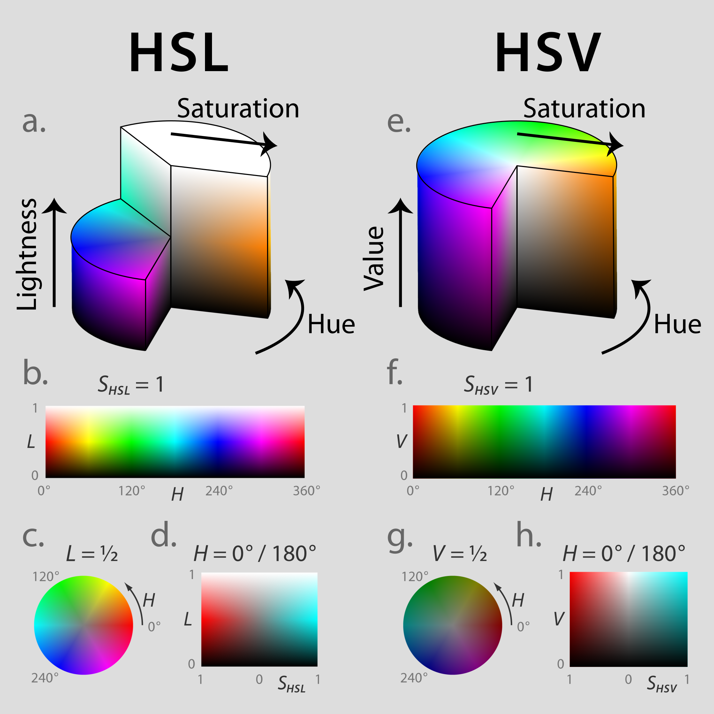

= Lab 13: Color Palette Generator DevLog
Pluto Zitek <https://github.com/GemedetAdept>

:description: DevLog for Lab 13 of my work on the color palette generator.
:url-repo: https://github.com/GemedetAdept/cs1400-color-palette-generator
:stem: latexmath

.Goals
****
* [x] Implement remaining conversion methods
** [x] HEX
*** [x] HEX to HSL
*** [x] HEX to HSV
*** [x] HEX to RGB
** [x] HSL
*** [x] HSL to HEX
** [x] HSV
*** [x] HEX
** [x] RGB
*** [x] RGB to HEX
* [ ] Implement ValueDeviation class for controlled randomization of output colors
** [x] Implement custom, adjustable logistic function
*** [x] Method to catch invalid floor and ceiling values
** [ ] Implement ValueDeviation methods
*** [ ] Hue, HSV
*** [ ] Hue, HSL
*** [ ] (R,G,B), RGB
*** [ ] (R,G,B), HEX
* [ ] Create a menu(s) for each step requiring user input
** [ ] Main menu
** [ ] Color code input
** [ ] Color harmony selection
* [ ] Link all methods together 
****

== Implementation and Progress
---

=== Challenges with Color Space Geometry
Because RGB and HEX both contain three values, each with the same range stem:[(\mathit{R,G,B}) \in \mathbb{R} \text{[0,1\]}] and stem:[(\mathit{H_R,H_G,H_B}) \in \mathbb{R} \text{[0$_{10}$,1$_{10}$\]}], which are all congruent, they can be geometrically visualized as _cubes_ (Fig. 1).

HSV and HSL, albeit also containing three values, contain two distinct ranges and value types. The hue (stem:[\mathit{H_V,H_L}]) has a different range and is measured in degrees: stem:[\mathit{H_V,H_L} \in \mathbb{R} \text{[0$^{\circ}$,360$^{\circ}$\]}]. This is distinct from the shared range and value type of saturation (stem:[\mathit{S_V,S_L}]), value (stem:[\mathit{V}]), and lightness (stem:[\mathit{L}]): stem:[\mathit{S_V,S_L} \in \mathbb{R} \text{[0,1\]}], stem:[\mathit{V} \in \mathbb{R} \text{[0,1\]}], stem:[\mathit{L} \in \mathbb{R} \text{[0,1\]}]. This combination of dislike ranges and types means that both HSV and HSL are visualized as _cylinders_ (Fig. 2). 

While stem:[\mathit{H_V}] and stem:[\mathit{H_L}] are equal, stem:[\mathit{S_V}] and stem:[\mathit{S_L}], & stem:[\mathit{V}] and stem:[\mathit{L}] are _not_. This requires four more, unique deviation methods, which will have to be individually tuned. As such, I've opted to limit the current scope and focus only on the deviation methods for the hues of HSV and HSL, and for all values of RGB and HEX. 

.RGB color space cube
[By SharkD - Own work. Download source code., CC BY-SA 3.0, https://commons.wikimedia.org/w/index.php?curid=9803283]
image::RGB_Cube_Show_lowgamma_cutout_b.png[]

.HSV and HSL color space cylinders
[By Jacob Rus - Own work, CC BY-SA 3.0, https://commons.wikimedia.org/w/index.php?curid=9445469]

== Color Conversion Methods
--- 

With Chad's Hexadecimal stem:[\Longleftrightarrow] Decimal (HtoD, DtoH) methods being completed, I have completed the rest of the color mode conversion methods. In doing so, I ran into a minor compatibility issue. That being the difference in the way that RGB value data is stored and the output of the HtoD methods. (Note that this is a dirct an issue with HEXstem:[\Longleftrightarrow]RGB conversion, but an _indirect_ issue with HSV and HSL. This is because, as will be show below, converting between HEX and HSL/HSV requires the respective RGB values as a stepping stone.)

=== Direct Data Discrepancy

The HtoD methods use and return a single, 32-bit/4-byte, signed integer. However, the current RGB conversion methods rely on there being 3, 8-bit/byte, unsigned integers, stored as a tuple. Luckily, the proccess for retrieving these values from the 32-bit integer (Int32) is straight-forward.

.HEX to RGB
1. Using the HtoD method, retrieve each byte and store in a `byte` array. Relative to RGB color, the array is structured as such: [Blue value, Green value, Red value, Pos/Neg sign]
2. Remove the Pos/Neg byte, leaving an array of 3 bytes.
3. Because the array is in reverse-RGB order, reverse the array.
4. Cast to `double` and store the respective values in a tuple.

.RGB to HEX
1. For each value in an RGB color, convert into a `byte` datatype.
2. Store the values in an array in reverse-RGB order, adding a `0` Pos/Neg byte as the last item.
3. Convert the array into an Int32.
4. Pass the Int32 through the DtoH method to retrieve the hexadecimal color string.

.HSV and HSL
I have not found any methods or equations for converting directly to HSV or HSL from a HEX color code. Instead, these conversions are done by first converting the input code to RGB, and then converting the RGB value to the desired output code.